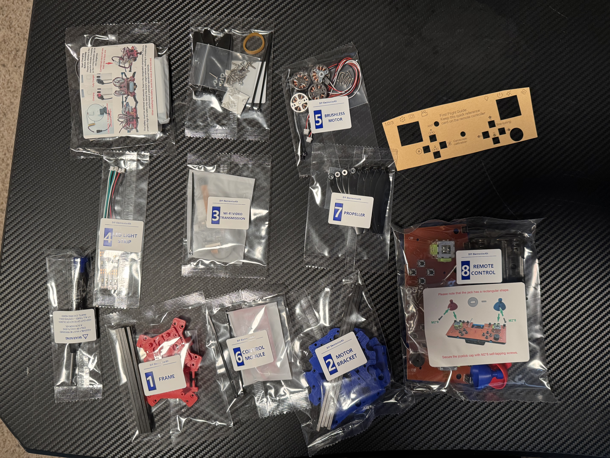
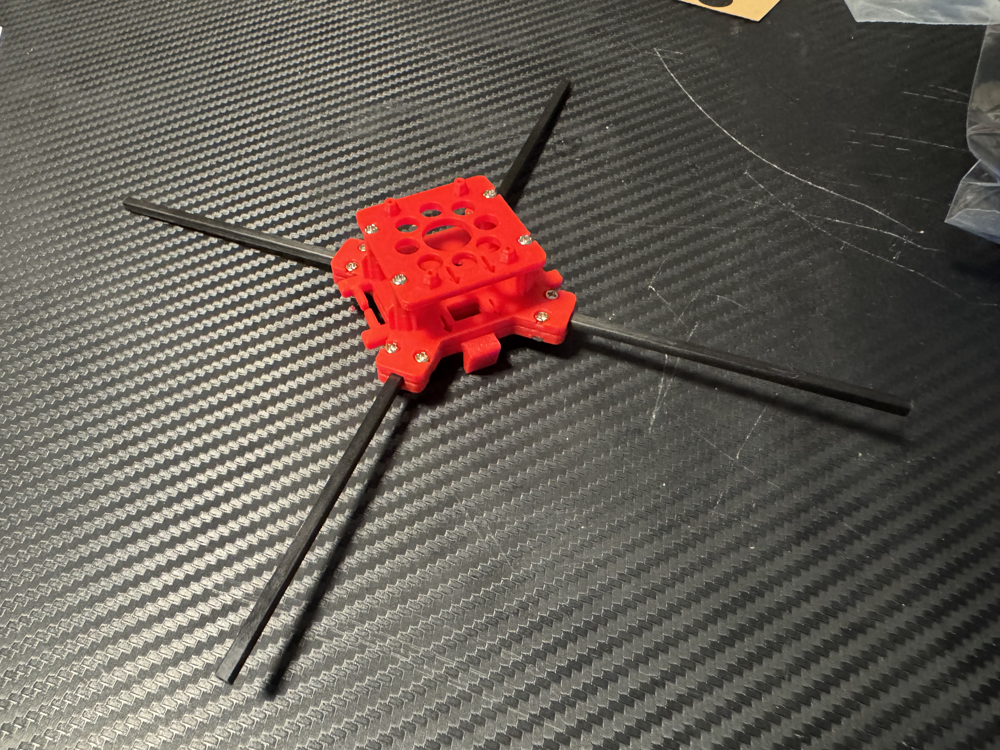
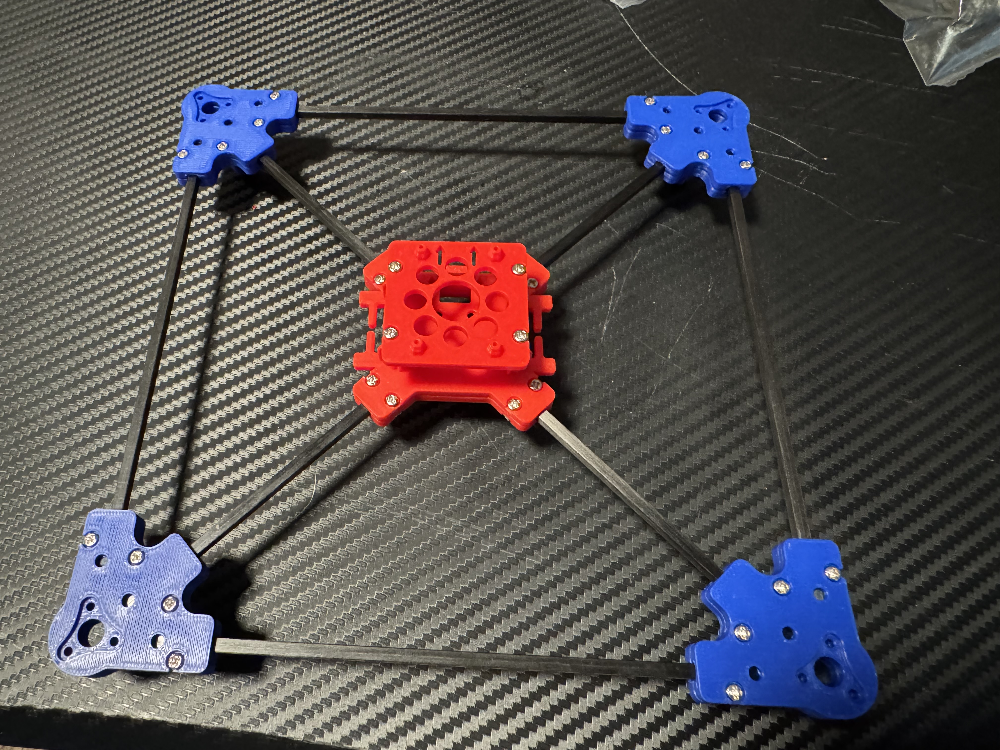
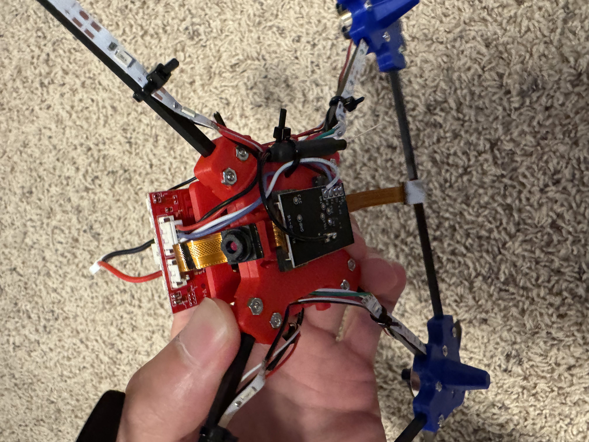
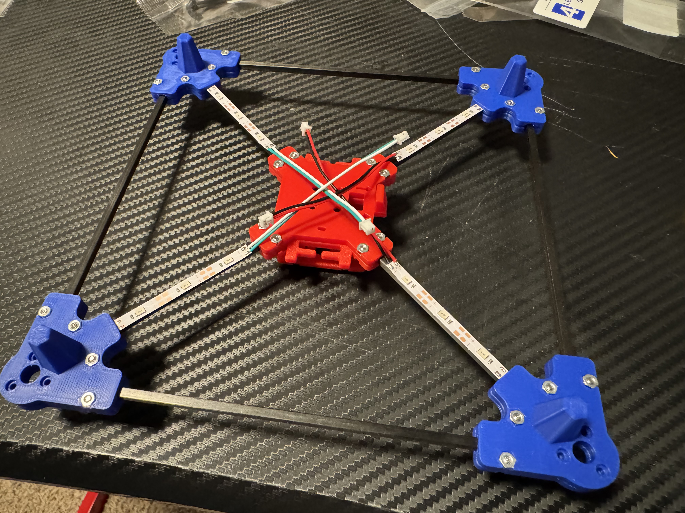
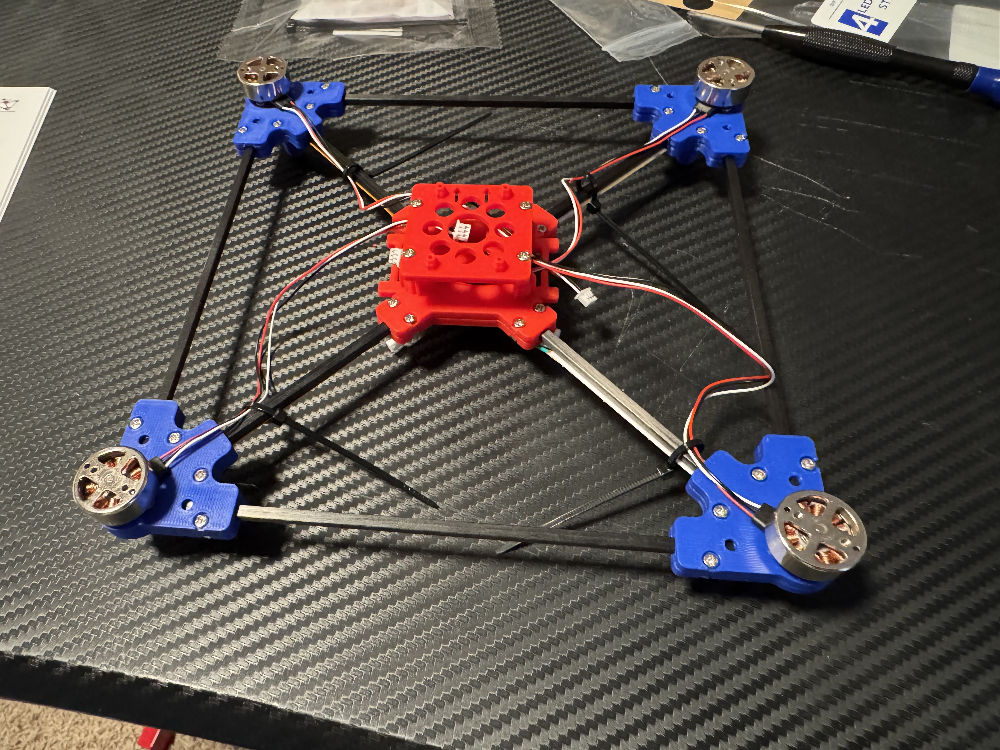
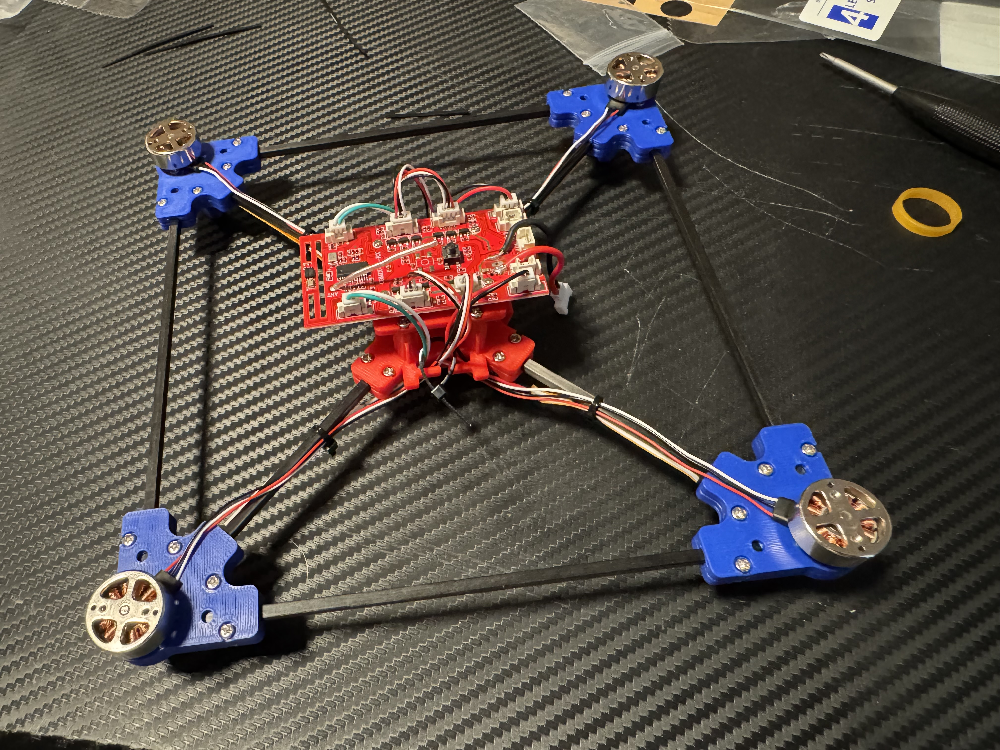
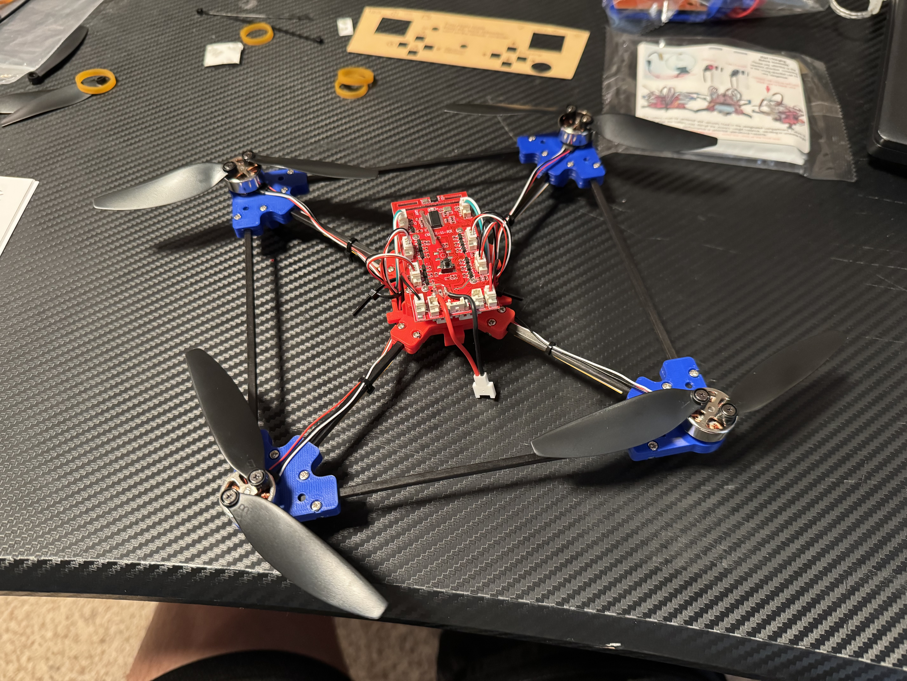

# F120 Drone Assembly Guide

This guide provides a brief overview of the main installation steps for assembling the F120 quadcopter drone based on the provided manual.

# Drone Parts

## 1. Frame Assembly (Start Assembling the Frame)

**Components:**
- Red frame parts
- Carbon fiber rods (3*2*100mm)
- Screws: M2.6, M2, M2.8 etc.
- Various brackets and mounts

**Steps:**
1. Identify and lay out all frame components from Pocket 1.
2. Attach the main frame arms to the central body using the provided screws.
3. Ensure proper orientation (front marked).
4. Tighten screws gradually to avoid deformation of the carbon fiber.
5. Verify the assembled frame structure is stable and symmetric.

**Tip:** Follow the assembly diagrams carefully. Arrows indicate direction and tightening order.

## 2. Motor Bracket Assembly

**Components:**
- Blue motor brackets
- Carbon fiber rods (3*2*130mm)
- Screws: M2.6, M2
- 16x M2 nuts/bolts

**Steps:**
1. Attach motor brackets to the frame arms.
2. Secure with screws and rods forming the triangular stability structure.
3. Ensure even spacing for propeller clearance (220mm wheelbase reference).
4. Tighten all connections firmly but avoid over-tightening.

**Key Note:** The triangular frame design enhances structural stability and flight performance.

## 3. Wi-Fi Video Transmission Module

**Components:**
- Video transmitter module
- Cameras (front + optical flow bottom)
- Ribbon cables (8*8mm, 10*15mm)
- Mounting hardware

**Steps:**
1. Connect the ribbon cables to the transmitter and camera modules.
2. Mount the front camera and bottom optical flow camera to the frame.
3. Secure the Wi-Fi video transmission unit to the appropriate position on the frame.
4. Route cables neatly and ensure proper alignment.
5. Test connections before full power-up.

**Tip:** Pay attention to camera orientation for correct video feed.

## 4. LED Light Strip Installation

**Components:**
- LED strips (Red, Green, White wires)
- Protective film removal
- Mounting tape/adhesive

**Steps:**
1. Remove protective film from the back of the LED strips.
2. Align and attach LED strips to the frame arms (follow color coding: Red front, Green/White others).
3. Connect wires according to the wiring diagram.
4. Ensure lights indicate correct front/rear direction.

**Note:** LED strips operate at 3.7V. Do not exceed voltage limits.

## 5. Brushless Motor Installation

**Components:**
- 4x Brushless motors (M1 6*6mm screws)
- Motor mounts
- Propellers (installed later)

**Steps:**
1. Mount each motor to the blue motor brackets using screws.
2. Connect motor wires to the ESC following the correct phase order.
3. Secure motors firmly.

**Technical Info:** Brushless motors provide high efficiency, low noise, and better torque for the F120.

## 6. Flight Control Module (FCB / Flight Controller)

**Components:**
- Red Flight Control Board (FCB)
- Screws: M1.4*5 (4x)
- Wires for motors, battery, camera, LED, receiver, etc.

**Steps:**
1. Place the flight control board in the center of the frame.
2. Secure it using the provided small screws (M1.4*5).
3. Connect the motor wires to the corresponding ESC outputs (Front-Left, Front-Right, Rear-Left, Rear-Right).
4. Connect the battery connector, power switch, obstacle avoidance (if applicable), camera interface, LED, and receiving antenna.
5. Double-check all connections according to the pinout diagram.

**Tip:** Ensure the board is oriented correctly (Front arrow pointing forward). Remove any protective film from the board.

## 7. Propeller Installation

**Components:**
- 4x Propellers (2x CW "A", 2x CCW "B")
- 8x Small screws (for securing propellers)

**Steps:**
1. Identify propeller types: A (usually for one rotation direction) and B (opposite).
2. Install propellers on the motors with the correct rotation direction:
- Match A and B propellers to their respective motors (check diagram for positions).
3. The text/face side of the propeller should face upward.
4. Tighten the mounting screws securely but do not overtighten.
5. Verify each propeller spins freely with no resistance.

**Critical Note:** Incorrect propeller installation is a common cause of crashes. Ensure CW (clockwise) and CCW (counter-clockwise) propellers are in the correct positions.

## General Assembly Tips
- Work in a clean, well-lit area.
- Follow the pocket/component lists carefully.
- Tighten screws progressively.
- Double-check orientations (front/back markings).
- Refer to "Must-Read" assembly details in the manual for common mistakes.
- Test each subsystem (frame rigidity, motor spin, video feed, LEDs, flight controller) before installing the battery and attempting first flight.

**Warning:** Improper assembly can lead to flight instability or damage. Ensure all connections are secure and polarities are correct before powering on.

For detailed diagrams, refer to the original manual pages.

# Finished Product
